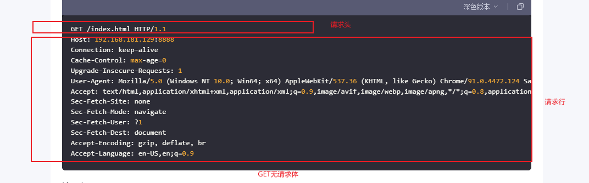
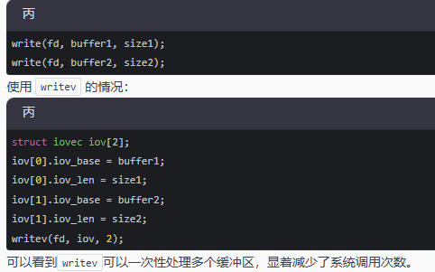

https://github.com/0voice/cpp_backend_awsome_blog/blob/main/%E3%80%90NO.211%E3%80%91%E3%80%90%E7%BD%91%E7%BB%9C%E3%80%91%E3%80%90%E6%93%8D%E4%BD%9C%E7%B3%BB%E7%BB%9F%E3%80%91%E8%AF%A6%E8%A7%A3select%E3%80%81poll%E3%80%81epoll.md

初始化框架，选择并发模型(异步IO并发模型Proactor,使用epoll多路复用机制)

服务端创建socket步骤

1.socket()      //创建socket
2.setsockopt()  //设置地址复用(可选),服务器关闭时，会出现一个time_wait时间，这段时间内，端口不能立即重新绑定和使用，设置地址端口复用后，当服务器崩溃或重启时，可以允许服务器在time_wait时间段内绑定 到相同端口，实现快速重启

3.bind()        //绑定IP和端口
4.listen()      //监听
5.accept()      //等待连接，阻塞
6.while(1){
    read();     //读数据
    sleep(1);
    write();    //发数据
}
7.close();      //关闭套接字

1.服务器用多线程实现多客户端通信
pthread_create()

2.服务器用多进程实现多客户端通信
pid_t pid = fork()
if(pid == 0){
    //子进程
}

IO多路复用技术(select/poll/epoll)
:一个线程,通过记录I/O流的状态来同时管理多个I/O,

1.select        :最大只支持1024个客户端连接，存在内核态到用户态的拷贝，且线性扫描整个待检测集合，造成额外开销,底层是线性表的结构
==============================================================================================================================================================
int select(int nfds, fd_set *readfds, fd_set *writefds,
           fd_set *exceptfds, struct timeval *timeout);     //timeout = 0,不断轮询; timeout = NULL,阻塞,等待条件满足; timeout != 0,超时时间

void FD_CLR(int fd, fd_set *set);   //清除某一个被监视的文件描述符
int  FD_ISSET(int fd, fd_set *set); //测试一个文件描述符是否是集合中的一员
void FD_SET(int fd, fd_set *set);   //添加一个文件描述符,将set中的某一位设置为1
void FD_ZERO(fd_set *set);          //清空集合中的文件描述符,将每一位都设置为0

fd_set可以理解为一个文件描述符集合

//使用案例
fd_set readfds;
int fd;
FD_ZERO(&readfds);   //清空readfds,相当于初始化
FD_SET(fd,&readfds);    //把fd添加到readfds集合中
if(FD_ISSET(fd,&readfds)){      //判断是否成功监视
    //监视成功
}
select(fdmax+1, readfds, 0, 0, 0);
==============================================================================================================================================================

2.poll          :与select类似，但是没有最大连接限制，主要取决于系统性能，也存在内核态到用户态的拷贝，且线性扫描整个待检测集合，造成额外的开销，底层是线性表的结构
==============================================================================================================================================================
#include <poll.h>
//每个委托poll检测的fd都对应这样一个结构体
struct pollfd{
    int fd;             /* 委托内核检测的文件描述符 */
    short events;       /* 委托内核检测文件描述符的什么事件 */          POLLIN是读事件，POLLOUT是写事件
    short revents;      /* 文件描述符实际发生的事件 -> 传出 */
}

struct pollfd myfd[100];    //需要检测的文件描述符个数
int poll(struct pollfd *fds, nfds_t nfds,int timeout);

//使用案例
struct pollfd readfds[1024];
for(int i = 0; i < 1024; i++){
    readfds[i].fd = -1;
    readfds[i].events = POLLIN;      //可读事件
}
readfds[0].fd = listenfd;
int maxfd = 0;
int ret = poll(readfds,maxfd + 1, -1);
if(readfds[0].revents & POLLIN){
    //新客户端到达
}
for(int i = 1; i < maxfd + 1; i++){
    if(readfds[i].revents & POLLIN){
        //处理客户端请求
    }
}
==============================================================================================================================================================

3.epoll         :没有最大连接限制，主要取决于系统性能，不存在内核到用户的拷贝(内核和用户采用区使用mmap共享内存)，epoll不存在线性扫描待检测集合，而是通过回调机制
                    直接返回准备就绪的文件描述符，底层是红黑树结构
==============================================================================================================================================================
#include <sys/epoll.h>

int epoll_create(int size)      //创建epoll实例，通过一棵红黑树管理待测集合,size指定一个大于0的数

//联合体,多个变量共用同一块内存
typedef union epoll_data{
    void* ptr;
    int fd;     //epoll_ctl第三个参数
    uint32_t u32;
    uint64_t u64;
}epoll_data_t;

struct epoll_event{
    uint32_t events;
    epoll_data_t data;
}

int epoll_ctl(int epfd, int op, int fd, struct epoll_event* event)      //管理红黑树上的文件描述符(添加,修改,删除)
int epoll_wait(int epfd, struct epoll_event* event, int maxevents, int timeout)     //检测epoll树上是否有就绪的文件描述符,event是传出参数,maxevents修饰event
                                                                                        timeout = 0不阻塞,timeout > 0阻塞timeout时长,timeout = -1一直阻塞

==============================================================================================================================================================

HTTP格式

writev() 和 write() 的区别
